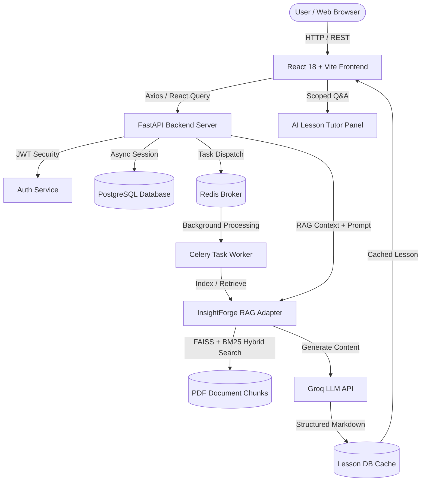

# CourseForge AI — AI-Powered Interactive Learning Platform (v1.0.0)


**CourseForge AI** is a state-of-the-art AI-powered learning platform and personal **AI Learning Coach** that transforms raw PDF documents into structured, interactive courses. Powered by a custom **Retrieval-Augmented Generation (RAG)** adapter, CourseForge AI parses document context, synthesizes course blueprints, generates interactive Markdown lessons with code syntax highlighting, delivers SuperMemo SM-2 spaced repetition flashcards, adaptive quizzes, habit heatmaps, and proactive AI coaching advice.

---

## 🚀 Quickstart

Launch the entire production stack (PostgreSQL, Redis, Celery Worker, FastAPI Backend, React Frontend, and Nginx Reverse Proxy) in a single command:

```bash
# Clone repository
git clone https://github.com/varshith-yakkala/CourseForge-AI.git
cd CourseForge-AI

# Launch production stack
docker-compose up -d --build
```

Access the application at `http://localhost`.

---

## 🏛️ System Architecture



### End-to-End Workflow
1. **Upload PDF**: User uploads a document ➔ Celery worker indexes chunks via InsightForge-AI (FAISS + BM25).
2. **Generate Blueprint**: LLM generates course outline (Lessons ➔ Topics ➔ Subtopics).
3. **On-Demand Lesson Generation**: User clicks a lesson ➔ Backend retrieves RAG context chunks ➔ LLM generates Markdown content ➔ Cached in DB.
4. **Interactive Learning**: User reads lesson with GFM formatting, code highlighting, and progress tracking.

---

## 📁 Repository Structure

```
CourseForge-AI/
├── backend/
│   ├── api/                  # FastAPI Endpoints & Pydantic Schemas
│   ├── core/                 # App Settings, Security, Exceptions, Middleware
│   ├── db/                   # Async SQLAlchemy Models & Alembic Migrations
│   ├── insightforge/         # RAG Engine Adapter (FAISS + BM25 Shim)
│   ├── llm/                  # PromptManager Templates & Pydantic Schemas
│   ├── services/             # Business Logic (CourseGenerator, LessonGenerator)
│   ├── tasks/                # Celery Background Worker Tasks
│   └── tests/                # Pytest Test Suites
├── frontend/
│   ├── src/
│   │   ├── api/              # Axios Client & React Query Hooks
│   │   ├── components/       # Layout, UI components, ErrorBoundary
│   │   ├── pages/            # Views (Dashboard, CourseDetail, Login)
│   │   ├── router/           # React Router
│   │   └── store/            # Zustand Stores
│   └── index.css             # Vanilla CSS Design System Tokens
├── docker/                   # Docker Compose & Container Configs
└── README.md
```

---

## 🚀 Local Installation & Setup

### Prerequisites
- Python 3.11+
- Node.js 18+ & npm
- Redis server
- PostgreSQL database

### 1. Environment Configuration
Copy the backend template to `backend/.env`:
```bash
cp backend/.env.example backend/.env
```
Fill in the environment variables:
- `APP_SECRET_KEY` and `JWT_SECRET_KEY` (Use `openssl rand -hex 32`)
- `POSTGRES_PASSWORD` / `DATABASE_URL`
- `GROQ_API_KEY`: obtain from [console.groq.com](https://console.groq.com)

### 2. Backend Setup
```bash
cd backend
python -m venv .venv
source .venv/bin/activate  # On Windows: .venv\Scripts\activate
pip install -r requirements.txt

alembic upgrade head
uvicorn main:app --reload --port 8001
```

### 3. Start Celery Worker (New Terminal)
```bash
cd backend
celery -A tasks.celery_app worker --loglevel=info --pool=solo
```

### 4. Frontend Setup (New Terminal)
```bash
cd frontend
npm install
npm run dev
```
Open your browser at: `http://localhost:5173`

---

## ☁️ Deployment Guide

CourseForge AI is designed to be deployed via Docker Compose or on managed PaaS providers like Render.

**For Render Deployment:**
1. Create a Web Service for the FastAPI backend (Docker environment).
2. Create a Background Worker for Celery.
3. Provision a managed PostgreSQL database and a Redis instance.
4. Set all environment variables (from `.env`) in the Render Dashboard.
5. Deploy the React frontend via Vercel, Netlify, or Render Static Site. Ensure `VITE_API_URL` points to your backend service.

---

## 🧪 Testing Instructions

Run backend Pytest suite:
```bash
cd backend
pytest --no-cov
```

Run frontend Vitest component tests:
```bash
cd frontend
npm test
```

---

## ⚠️ Known Limitations
- Background task queues (Celery) require a persistent Redis instance.
- LLM response generation can take 15-30 seconds depending on Groq API limits.
- PDFs exceeding 50MB may cause memory spikes during FAISS indexing.

## 🔮 Future Improvements
- Multi-language UI support.
- Stripe payment integration for premium courses.
- User-to-user community discussion forums.
- Export to SCORM / LMS compatible formats.
- Mobile-native React Native application.

---

## 📄 License
Distributed under the MIT License.
