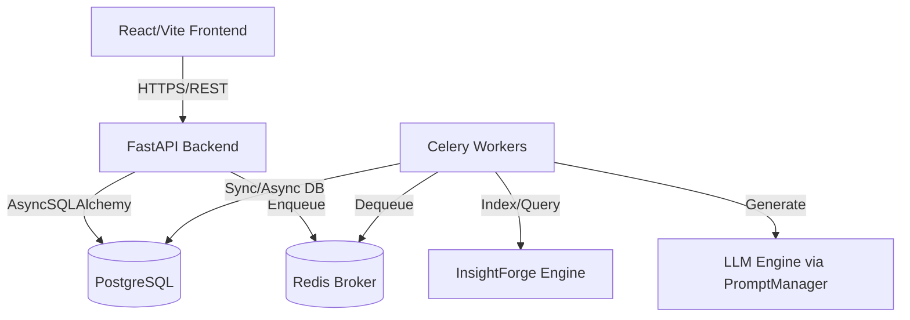

# System Architecture

CourseForge is built as a robust, asynchronous Monolithic architecture with a clear separation of concerns, designed to safely process computationally heavy machine learning workloads without blocking the main web server.

## Overview

## 1. Frontend (React + Vite)
- **Data Fetching:** React Query manages caching, polling, and invalidations.
- **State:** Zustand is used for global state (like notifications and auth).
- **Styling:** Custom Vanilla CSS Design System. No utility frameworks.

## 2. Backend (FastAPI)
- **API Layer:** Fast, asynchronous routing handling JSON validation via Pydantic.
- **Service Layer:** Business logic resides in `backend/services/`. Routes must remain thin.
- **Data Layer:** `asyncpg` drives SQLAlchemy. Alembic manages migrations.

## 3. Background Processing (Celery & Redis)
- **Document Indexing:** CPU-heavy extraction and FAISS indexing runs in the background.
- **AI Generation:** Multi-step LLM chains (Outline -> Lessons -> Content) execute asynchronously to prevent HTTP timeouts.

## 4. AI Engine (InsightForge)
- An internal adapter pattern connects CourseForge to the InsightForge RAG (Retrieval-Augmented Generation) engine. 
- The engine combines Dense (FAISS) and Sparse (BM25) retrieval.
