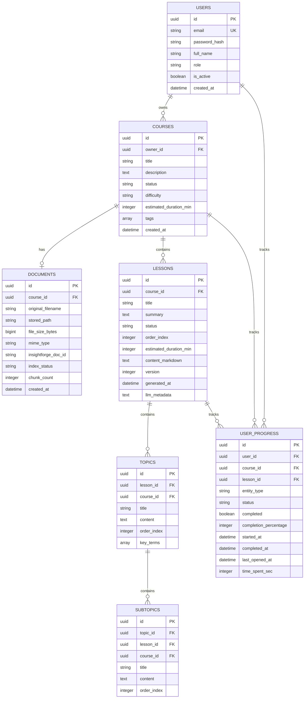

# CourseForge AI — Database Schema Specification

## Entity Relationship Diagram

---

## Model Descriptions & Column Constraints

### `users` Table
- Stores user credentials, hashed passwords (bcrypt), and account state.
- PK: `id` (UUIDv4). Unique index on `email`.

### `courses` Table
- Stores top-level course metadata and generation state.
- `status`: `"processing"`, `"ready"`, `"error"`.

### `documents` Table
- Stores uploaded PDF metadata and InsightForge indexing state.
- `index_status`: `"pending"`, `"processing"`, `"ready"`, `"error"`.

### `lessons` Table
- Stores course lessons, on-demand Markdown text, and generation versions.
- `status`: `"pending"`, `"generating"`, `"ready"`, `"failed"`.
- `version`: Incrementing integer (`1`, `2`, `3`...).

### `user_progress` Table
- Stores user progress metrics per lesson/course across sessions.
- Composite unique index on `(user_id, lesson_id)`.
