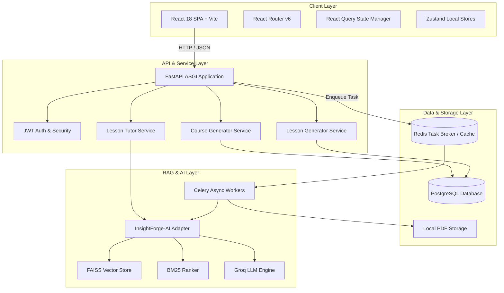

# CourseForge AI — System Architecture Specification

## Overview
CourseForge AI is an interactive learning platform that automatically converts uploaded PDF documents into multi-tier educational courses using Retrieval-Augmented Generation (RAG).

---

## High-Level Component Diagram

---

## Architectural Principles & Patterns

1. **Async-First Execution**: Non-blocking I/O throughout FastAPI async routes and SQLAlchemy async sessions (`asyncpg`).
2. **On-Demand Lazy Generation**: Course outlines are generated first; individual lesson Markdown is generated lazily when opened by the user, saving memory and LLM API costs.
3. **Dual-Layer Caching**: Generated lessons are stored in PostgreSQL (`Lesson.content_markdown`). Subsequent requests return cached Markdown immediately without invoking LLM inference.
4. **Adapter Pattern for RAG**: The `InsightForgeEngine` class abstracts the underlying InsightForge-AI engine (FAISS + BM25 hybrid search), shielding CourseForge business logic from LLM/RAG internal changes.
5. **Decoupled Task Processing**: Heavy operations (PDF parsing, chunking, indexing) run out-of-band on Celery task workers backed by Redis.
