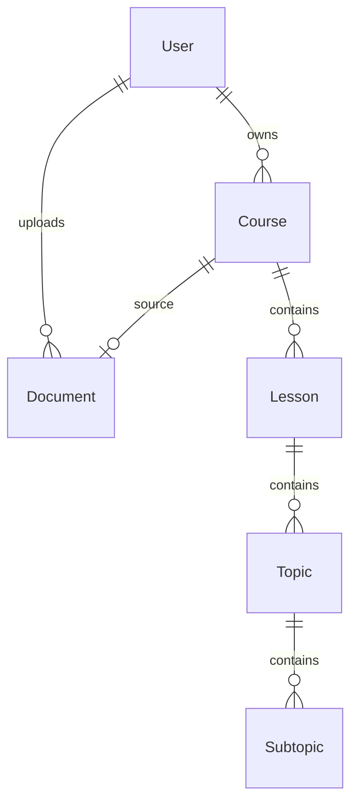

# System Design

## Database Schema

## AI Pipeline Design

### 1. Document Ingestion Pipeline
1. **Upload**: User uploads a PDF via `POST /documents/upload`.
2. **Storage**: PDF saved to local storage/S3.
3. **Queue**: `process_document_task` sent to Celery.
4. **InsightForge**: Extract text -> Chunk -> Generate Embeddings -> Store in FAISS & BM25 indices.
5. **State**: Document status moves from `processing` to `ready`.

### 2. Course Generation Pipeline (Two-Layer Approach)
To ensure reliability and responsiveness, generation is split into two layers:

**Layer 1: The Blueprint (Async Celery Task)**
1. **Trigger**: `POST /courses/{id}/generate`.
2. **Retrieve Context**: `InsightForgeEngine` retrieves a holistic summary of the document.
3. **Prompt**: `PromptManager` injects context into the `course_blueprint` prompt template.
4. **Generate & Validate**: LLM generates JSON. Validated via Pydantic `CourseBlueprintResponse`.
5. **Persist**: Saves `Lesson`, `Topic`, and `Subtopic` skeletons to PostgreSQL.

**Layer 2: Detailed Content (On-Demand / JIT)**
1. **Trigger**: User clicks into a specific lesson.
2. **Retrieve Focus Context**: Retrieve chunks highly specific to the Topic.
3. **Generate & Cache**: Generate detailed explanations, save them to the DB, and stream back to the UI.
